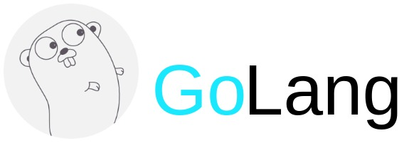

Go, also known as Golang, is a modern programming language developed by Google in 2007. Go is an open-source, statically typed language that is designed for high-performance and concurrent programming. The language is popular for its simplicity, efficiency, and built-in support for concurrency.

Go was designed to be a fast and efficient language, with a focus on compiling quickly and executing code quickly. Its syntax is simple and easy to read, making it a great language for beginners to learn. Go also has a garbage collector, which automatically manages memory allocation and deallocation, making it easier to write and maintain code.

One of the unique features of Go is its built-in support for concurrency, which allows multiple tasks to be executed simultaneously. This is achieved through the use of goroutines, which are lightweight threads that can be created easily and efficiently. Go also has a built-in communication mechanism called channels, which allow goroutines to communicate with each other and synchronize their operations.

Go is used in a wide range of applications, including web development, system programming, and cloud computing. Some popular tools and frameworks in the Go ecosystem include the Go standard library, the Gorilla web toolkit, the Buffalo web framework, and the Kubernetes container orchestration system.
