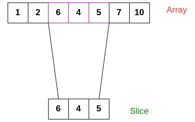

In Go, arrays and slices are two similar but distinct types of data structures that are used to store a collection of values.



### Arrays

An array is a fixed-size collection of elements of the same type, where each element is identified by an index. The size of an array is specified when it is created, and it cannot be changed during runtime. The syntax for creating an array in Go is as follows:

```go
var array [size]type
```

Here, `size` is the number of elements in the array, and `type` is the data type of the elements. Here's an example:

```go
var a [3]int
a[0] = 1
a[1] = 2
a[2] = 3
```

This creates an array `a` with three elements, all of type `int`. The values of the elements are set individually using the indexing syntax, where the first element has index `0`, the second element has index `1`, and so on.

### Slices

A slice is a dynamic data structure that provides a more flexible way of working with collections. Unlike an array, a slice is not of a fixed size, and its length can change during runtime. A slice is created by specifying a contiguous section of an underlying array using a slice expression. The syntax for creating a slice in Go is as follows:

```go
var slice []type = array[start:end]
```

Here, `array` is the underlying array, `start` is the index of the first element to include, and `end` is the index of the first element to exclude. If `start` is omitted, it defaults to `0`, and if `end` is omitted, it defaults to the length of the underlying array.

Here's an example:

```go
a := [5]int{1, 2, 3, 4, 5}
s := a[1:4]
```

This creates an array `a` with five elements, and then creates a slice `s` that includes the second through fourth elements of `a`. The syntax `a[1:4]` specifies that the slice should start at index `1` and end at index `4`, excluding the element at index `4`.

Slices can be modified using the `append` and `copy` functions, and can be used to implement dynamic data structures like stacks and queues.