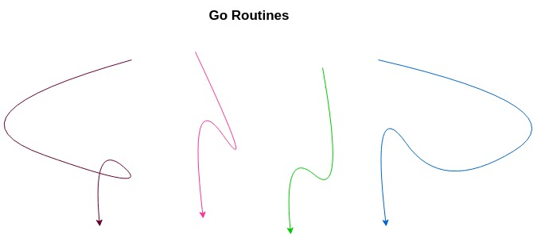

Concurrency is a powerful feature in Go that allows multiple tasks to be executed simultaneously. Concurrency in Go is based on the concept of goroutines, which are lightweight threads that are managed by the Go runtime.



In Go, a goroutine is defined using the `go` keyword, followed by a function call. Here is an example:

```go
func main() {
    go sayHello()
    fmt.Println("This is the main function")
}

func sayHello() {
    fmt.Println("Hello from a goroutine!")
}
```

This defines a function `sayHello` that prints a message, and then calls it using the `go` keyword in the `main` function. This means that the `sayHello` function will be executed as a goroutine, and will run concurrently with the `main` function.

In addition to goroutines, Go also provides channels for communication between concurrent processes. Channels are used to send and receive data between goroutines, and are defined using the `chan` keyword. Here is an example:

```go
func main() {
    c := make(chan string)
    go sayHello(c)
    message := <-c
    fmt.Println(message)
}

func sayHello(c chan string) {
    c <- "Hello from a goroutine!"
}
```

This defines a function `sayHello` that takes a channel as an argument, sends a message to the channel, and then the `main` function receives the message from the channel and prints it.

Channels can be used for many different types of concurrent communication and synchronization, and are a powerful tool for building concurrent programs in Go.

In addition to goroutines and channels, Go also provides a number of other tools for concurrency, such as mutexes and atomic operations. These tools allow developers to write safe and efficient concurrent programs in Go.