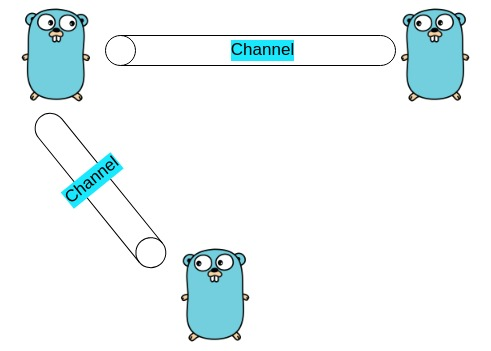

Channels are a fundamental feature in Go that enable safe communication between concurrent processes. Channels are used to send and receive values between goroutines, which are lightweight threads managed by the Go runtime.



In Go, a channel is created using the `make` function and the `chan` keyword. The `make` function creates a new channel, and the `chan` keyword specifies the type of values that can be sent and received on the channel. Here is an example:

```go
ch := make(chan int)
```

This creates a new channel `ch` that can send and receive integers.

To send a value on a channel, the `<-`operator is used with the channel and the value to be sent. For example:

```go
ch <- 10
```

This sends the integer value `10` on the channel `ch`.

To receive a value from a channel, the `<-` operator is used with the channel. For example:

```go
val := <- ch
```

This receives a value from the channel `ch` and stores it in the variable `val`.

Channels can be used to implement a variety of concurrent communication patterns, including producer-consumer and worker-pool patterns. Channels can also be used to synchronize access to shared resources between goroutines.

