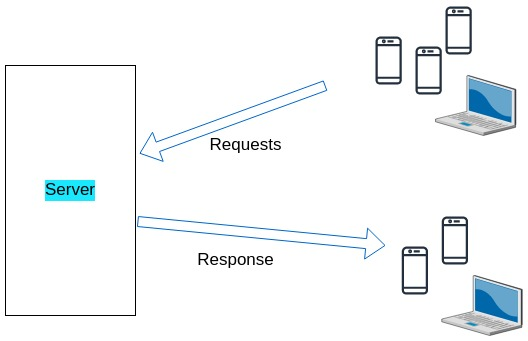

In Go, it's easy to create an HTTP server that listens for requests and returns responses. Here's a simple example that creates an HTTP server and responds to all requests with "Hello, World!".



```go
package main

import (
    "fmt"
    "net/http"
)

func helloHandler(w http.ResponseWriter, r *http.Request) {
    fmt.Fprint(w, "Hello, World!")
}

func main() {
    http.HandleFunc("/", helloHandler)
    if err := http.ListenAndServe(":8080", nil); err != nil {
        fmt.Printf("Error starting HTTP server: %v\n", err)
    }
}
```

Here's what this code does:

- The `helloHandler` function is a request handler that takes an `http.ResponseWriter` and an `http.Request` as arguments. It writes the string "Hello, World!" to the response writer.
- The `main` function registers the `helloHandler` function with the `http.HandleFunc` function, which maps the root URL path ("/") to the helloHandler.
- The `main` function then starts the HTTP server using the `http.ListenAndServe` function. It listens on port 8080, and passes `nil` as the handler argument, which means that it will use the `http.DefaultServeMux` as the request multiplexer.

To run this code, save it as a file named `main.go` and then run `go run main.go` in your terminal. This will start the HTTP server and listen for incoming requests.

You can test this HTTP server by visiting http://localhost:8080 in your web browser or by using a tool like `curl` to send an HTTP request:

```bash
$ curl http://localhost:8080
Hello, World!
```

This is just a simple example, but it shows how easy it is to create an HTTP server in Go. With just a few lines of code, you can handle HTTP requests and return responses to clients.