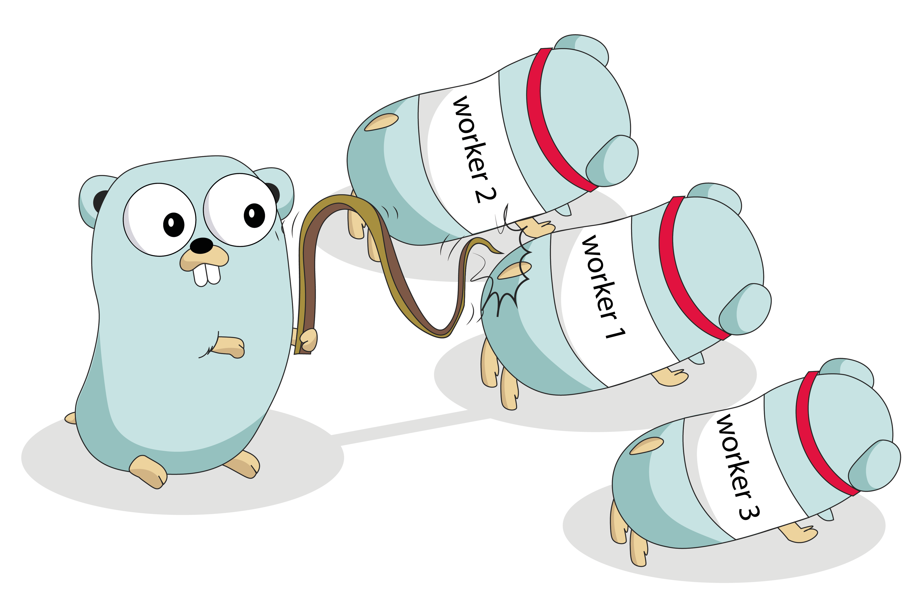

A worker pool is a group of worker goroutines that process jobs from a work queue. The worker pool pattern is commonly used to parallelize CPU-bound work or to limit the number of active connections to an external service.



*image credit: gwp*

In Go, worker pools can be implemented using channels and goroutines. Here's an example of a simple worker pool that processes jobs in parallel:

```go
package main

import (
	"fmt"
	"sync"
)

type Job struct {
	id int
}

func processJob(id int) {
	fmt.Printf("Processing job %d...\n", id)
}

func worker(id int, jobs <-chan Job, wg *sync.WaitGroup) {
	defer wg.Done()

	for job := range jobs {
		processJob(job.id)
		fmt.Printf("Worker %d finished job %d\n", id, job.id)
	}
}

func main() {
	// Create a work queue of 10 jobs
	jobs := make(chan Job, 10)

	// Create a WaitGroup to synchronize the workers
	var wg sync.WaitGroup

	// Start 3 workers
	numWorkers := 3
	for i := 0; i < numWorkers; i++ {
		wg.Add(1)
		go worker(i, jobs, &wg)
	}

	// Add 10 jobs to the work queue
	numJobs := 10
	for i := 0; i < numJobs; i++ {
		jobs <- Job{i}
	}
	close(jobs)

	// Wait for all workers to finish
	wg.Wait()
	fmt.Println("All jobs have been processed")
}
```

Here's what this code does:

- The `Job` struct represents a job that needs to be processed. In this example, a job is simply an integer ID.
- The `processJob` function simulates processing a job by printing a message to the console.
- The `worker` function is the worker goroutine that processes jobs from the work queue. It receives a channel of jobs and a pointer to a `WaitGroup` as arguments. It uses a `for` loop to continuously receive jobs from the channel and process them. When there are no more jobs in the channel, the worker signals that it has finished by calling `wg.Done()`.
- The `main` function creates a work queue of 10 jobs, starts 3 worker goroutines, adds the jobs to the work queue, and waits for all workers to finish using the `WaitGroup`.

To run this code, save it as a file named `main.go` and then run `go run main.go` in your terminal. This will start the worker pool and process the jobs in parallel.

You can adjust the number of workers and jobs by changing the `numWorkers` and `numJobs` variables in the `main` function. The worker pool will automatically scale to handle the number of jobs you specify.