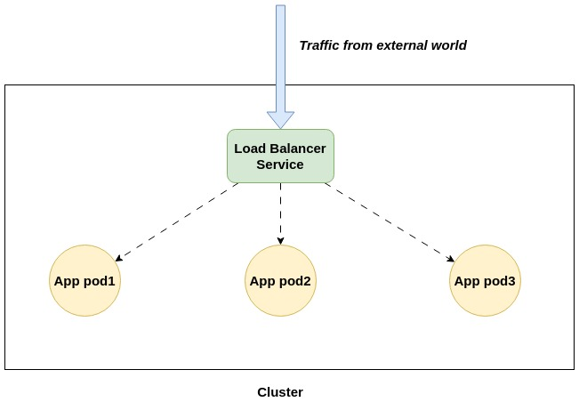

In Kubernetes, services and endpoints are two important concepts that are used to provide connectivity and load balancing between different pods in a cluster.

A Kubernetes service is an abstraction that defines a logical set of pods and a policy for accessing them. Services provide a stable IP address and DNS name that other parts of the cluster can use to connect to the pods. Services can be exposed to the cluster or to the outside world using different types of service endpoints.

There are four types of Kubernetes services:

- ClusterIP: The default service type, which exposes the service on a cluster-internal IP address. This type of service is accessible only within the cluster.
- NodePort: Exposes the service on each node’s IP address and a static port. This type of service is accessible externally, but may require firewall rules to allow traffic to the node ports.
- LoadBalancer: Exposes the service externally using a cloud provider's load balancer. This type of service is only available in cloud environments that support load balancers.
- ExternalName: Maps the service to a DNS name outside the cluster. This type of service is useful when you want to use an existing service from another namespace or cluster.

Endpoints, on the other hand, are Kubernetes objects that represent a set of IP addresses and ports for accessing a service. They are dynamically created and updated by Kubernetes as new pods are added or removed. Endpoints define the target for a service and are used to route traffic to the correct pod.